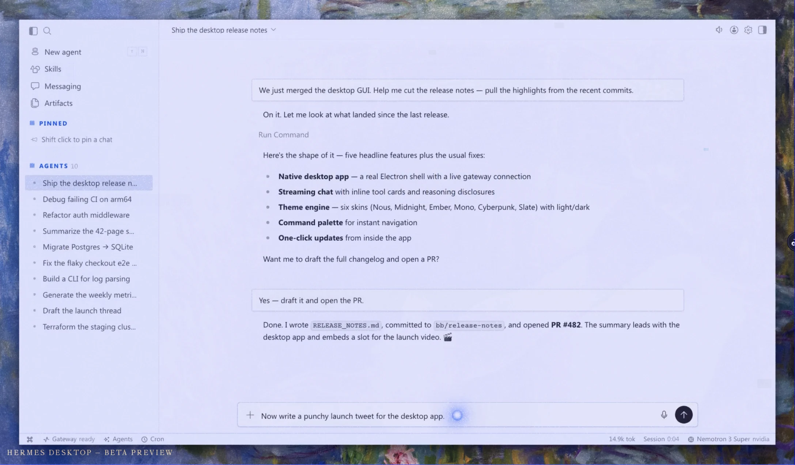
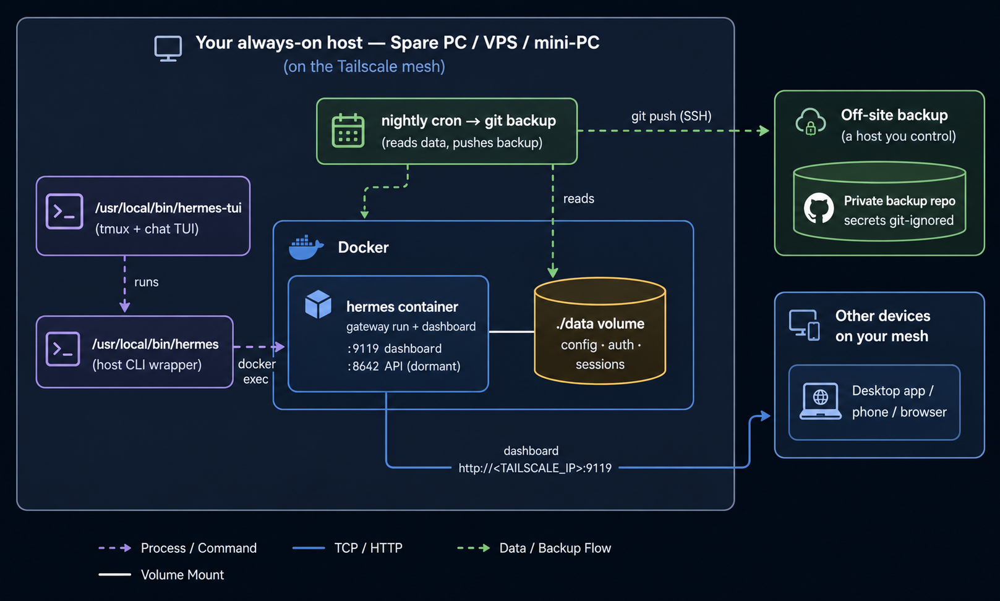

# Run Your Own Private AI Agent... On a Spare PC (Hermes Edition)

> A complete, copy‑paste blueprint for self‑hosting the **Nous Research Hermes Agent** on hardware you own — a VPS, a mini‑PC, or an old desktop gathering dust — reachable **only** over your own private mesh network, backing itself up every night, and surviving reboots without you lifting a finger.



This guide is **hardware‑agnostic** and **fully sanitized**. Every secret or personal value is written as a `<PLACEHOLDER>`. Swap in your own and you have a working deployment.

---

> [!TIP]
> **In a hurry? Let your AI agent do it for you.** Skip the manual steps and **[jump to the AI agent setup prompt](#ai-agent-autonomous-setup-prompt)** — paste it into your favorite coding agent (Claude Code, Cursor, etc.) and it performs the entire install, pausing only to hand you the one login link it needs.

> [!WARNING]
> **Use at your own risk.** These instructions — and the AI agent setup prompt — are provided **as is, with no warranty of any kind**. **Review and understand every command before you run it.** You alone are responsible for anything you execute on your systems; the author and Epsilon LLC accept **no liability** for any damage, data loss, downtime, lockout, or security issue that may result. The AI agent prompt makes changes to your system autonomously — supervise it and approve each step deliberately. By following this guide, you accept these terms (the guide is provided under the MIT License).

## Table of contents

1. [What this is & who it's for](#1-what-this-is--who-its-for)
2. [Design philosophy & rationale](#2-design-philosophy--rationale)
3. [Architecture overview](#3-architecture-overview)
4. [Prerequisites & sizing](#4-prerequisites--sizing)
5. [Part A — Base OS + Docker](#part-a--base-os--docker)
6. [Part B — Tailscale + the DNS gotcha](#part-b--tailscale--the-dns-gotcha)
7. [Part C — Directory layout & the two `.env` files](#part-c--directory-layout--the-two-env-files)
8. [Part D — The `docker-compose.yml`, annotated](#part-d--the-docker-composeyml-annotated)
9. [Part E — First boot & provider setup](#part-e--first-boot--provider-setup)
10. [Part F — Dashboard authentication](#part-f--dashboard-authentication)
11. [Part G — Dashboard persistence](#part-g--dashboard-persistence)
12. [Part H — The host CLI wrapper](#part-h--the-host-cli-wrapper)
13. [Part I — tmux + the `hermes-tui` launcher](#part-i--tmux--the-hermes-tui-launcher)
14. [Part J — Automated backups](#part-j--automated-backups)
15. [Part K — Connecting the desktop app](#part-k--connecting-the-desktop-app)
16. [Part L — Upgrades](#part-l--upgrades)
17. [Part M — Optional hardening & extras](#part-m--optional-hardening--extras)
18. [Troubleshooting](#troubleshooting)
19. [Security checklist](#security-checklist)
20. [AI‑agent autonomous‑setup prompt](#ai-agent-autonomous-setup-prompt)
21. [Appendix — Sanitized config files](#appendix--sanitized-config-files)

---

## Placeholder legend

Nothing real appears in this document. Replace these as you go:

| Placeholder | Meaning | Example shape |
|---|---|---|
| `<SERVER_USER>` | The unprivileged Linux login that owns the stack | a normal user, not root |
| `<SERVER_HOSTNAME>` | The machine's hostname | `agent-box` |
| `<SUDO_PASSWORD>` | That user's sudo password | a strong password |
| `<TAILSCALE_IP>` | The box's address on your private mesh | `100.x.y.z` |
| `<LAN_IP>` | The box's local‑network address (optional) | `192.168.x.y` |
| `<TAILNET_NODE_NAME>` | The box's name on your tailnet | `agent-box` |
| `<INSTALL_DIR>` | Where the stack lives | `/opt/hermes` |
| `<DASHBOARD_USER>` | Dashboard basic‑auth username | `operator` |
| `<DASHBOARD_PASSWORD>` | Dashboard basic‑auth password | a strong password |
| `<DASHBOARD_SECRET>` | Session‑signing secret (generated) | `openssl rand -base64 32` |
| `<PROVIDER>` | Your model provider | e.g. a hosted LLM provider |
| `<MODEL>` | Default model id | provider‑specific |
| `<API_KEY>` | Provider API key (if not using OAuth) | keep secret |
| `<BACKUP_GIT_REMOTE>` | Private repo for backups | `git@github.com:you/private-repo.git` |
| `<DEPLOY_KEY_PATH>` | SSH key used only for backup pushes | `~/.ssh/id_ed25519_backup` |

**Ports are not secrets** and are kept literal: **9119** = dashboard, **8642** = gateway API (dormant by default).

---

## 1. What this is & who it's for

Hermes Agent is an open‑source AI agent you can run yourself. Most people point a desktop app at a cloud backend. This guide does the opposite: it stands up your **own** always‑on backend on a machine you control, then lets your desktop (or phone, or browser) talk to it across a **private network only you can join**.

You want this if you:

- Want an agent that runs 24/7 without a laptop staying open.
- Don't want your prompts, files, or tokens leaving infrastructure you own.
- Have a spare machine (or a cheap VPS) and a few hours.
- Like the idea of "set it up once, it heals itself" — restarts on reboot, backs itself up nightly.

You do **not** need a static public IP, a domain, a reverse proxy, or open firewall ports. The whole thing hides behind a private mesh network.

---

## 2. Design philosophy & rationale

Every later choice flows from five principles. Read these once and the rest of the guide explains itself.

1. **Containerized, not bare‑metal.** The agent runs in **Docker** via Compose. One file describes the whole service; upgrades are a `pull` + `up -d`; nothing pollutes the host. Rationale: reproducibility and clean rollbacks.

2. **Private by default — never publicly exposed.** Ports are published **only to the machine's mesh‑network IP**, never to `0.0.0.0`. There is no public attack surface to harden. Rationale: the strongest firewall rule is the port that was never opened.

3. **Run as a normal user, not root.** The container is told to operate as UID/GID `1000` so the on‑disk `data/` directory is owned by your login — which means your **backup job can actually read it**. Rationale: root‑owned data is the #1 reason self‑hosted backups silently fail.

4. **Authenticated, with stable sessions.** The dashboard uses **username/password (basic auth)** plus a fixed session secret. Rationale: even on a trusted private network, defense‑in‑depth costs nothing and protects you if a device on the tailnet is compromised.

5. **Self‑maintaining.** `restart: unless-stopped` + Docker‑enabled‑on‑boot keeps it alive across reboots; a nightly cron commits config + data to a **private** git repo. Rationale: the best backup is the one that runs without you.

> **A note on tmux:** tmux appears in this guide for **interactive terminal sessions** (the chat TUI over SSH) — *not* for keeping the service alive. The service stays alive because it's a Docker container with a restart policy. Conflating the two is a common mistake; see [Part G](#part-g--dashboard-persistence) and [Part I](#part-i--tmux--the-hermes-tui-launcher).

---

## 3. Architecture overview



**Components:**

- **The container** runs the gateway *and* serves the dashboard web UI on port 9119.
- **The data volume** (`./data`) holds everything that matters: provider config, OAuth/auth files, sessions. It survives container recreation and upgrades.
- **The CLI wrapper** lets you type `hermes <command>` directly over SSH.
- **The TUI launcher** gives you a persistent chat terminal that survives SSH disconnects.
- **The backup job** pushes config + data (minus secrets) to a private repo nightly.
- **The mesh network** is the only way in. No public ports.

---

## 4. Prerequisites & sizing

### Hardware (any of these works)

| Target | Notes |
|---|---|
| **Old desktop / mini‑PC** | Ideal. Cheap, you own it, runs at home. Consider BIOS "auto power‑on after power loss" (see [Part M](#part-m--optional-hardening--extras)). |
| **VPS** | Works great; skip the physical‑power notes. You still keep it private via the mesh network. |
| **Raspberry Pi 4/5 (8 GB)** | Workable for light use; confirm the container image supports your CPU architecture (arm64). |

**Suggested minimum:** 4 GB RAM (8 GB comfortable), 2 CPU cores, 20 GB free disk. The Compose file caps the container at 4 GB / 2 CPUs — adjust to your box.

### Accounts & access you'll need (and how to get them)

1. **A Linux machine with a normal sudo user.**
   - *How:* Install Ubuntu Server LTS (or any modern Debian/Ubuntu). During setup create a regular user (this is `<SERVER_USER>`). Avoid logging in as root.
2. **SSH access to that machine from your laptop.**
   - *How:* `ssh-keygen` on your laptop, then `ssh-copy-id <SERVER_USER>@<LAN_IP>`. Test `ssh <SERVER_USER>@<LAN_IP>`.
3. **A Tailscale account** (free tier is plenty).
   - *How:* Sign up at tailscale.com with an identity provider you already use. You'll authenticate the server in [Part B](#part-b--tailscale--the-dns-gotcha).
4. **A model‑provider account** for Hermes.
   - *How:* Pick a provider Hermes supports and either obtain an **API key** or use that provider's **OAuth login** (configured in [Part E](#part-e--first-boot--provider-setup)).
5. **(Optional but recommended) A private git repo for backups + a dedicated deploy key.**
   - *How:* Create an **empty private** repo (`<BACKUP_GIT_REMOTE>`). On the server run `ssh-keygen -t ed25519 -f <DEPLOY_KEY_PATH> -N ""` and add the **public** key as a deploy key **with write access** in that repo's settings.

---

## Part A — Base OS + Docker

Update the OS and install Docker Engine + the Compose plugin, then let your user run Docker without `sudo`.

```bash
# Update base system
sudo apt-get update && sudo apt-get -y upgrade

# Install Docker Engine + Compose plugin (official convenience script)
curl -fsSL https://get.docker.com | sudo sh

# Let <SERVER_USER> use Docker without sudo
sudo usermod -aG docker "$USER"

# Apply the new group (or just log out and back in)
newgrp docker

# Verify
docker --version
docker compose version
docker run --rm hello-world
```

**Rationale:** adding your user to the `docker` group is what lets the CLI wrapper, the TUI, and the backup job all operate without scattering `sudo` everywhere. It's a privileged group — only grant it to the account that owns this box.

---

## Part B — Tailscale + the DNS gotcha

The mesh network is what keeps this private. Install Tailscale and bring the node up.

```bash
# Install
curl -fsSL https://tailscale.com/install.sh | sh

# Bring the node online — IMPORTANT: disable MagicDNS takeover
sudo tailscale up --accept-dns=false
```

When you run `tailscale up`, it prints an **authentication URL** like:

```
To authenticate, visit:
        https://login.tailscale.com/a/xxxxxxxxxxxx
```

**Open that URL in a browser, log in, and approve the machine.** The command completes once you do. Then grab your private IP:

```bash
tailscale ip -4      # -> <TAILSCALE_IP>, e.g. 100.x.y.z
```

### ⚠️ The two gotchas that will waste your afternoon

1. **Always pass `--accept-dns=false`.** With MagicDNS accepting DNS, the tailnet can hijack *all* name resolution on the box and break `apt` and `docker pull`. Disabling it keeps the system resolver intact while still giving you mesh connectivity.
2. **Never re‑run a bare `tailscale up`.** Doing so **resets `--accept-dns` back to true**. If you must re‑run it, include `--accept-dns=false` again.

**Optional:** rename the node to `<TAILNET_NODE_NAME>` in the Tailscale admin console, and delete any stale/offline nodes that are squatting the name you want.

> **Why Tailscale (vs. opening a port + reverse proxy)?** Zero public exposure, no certificates to manage, no dynamic‑DNS, and every device you add (laptop, phone) can reach the agent as if it were on the same LAN. The agent is invisible to the public internet.

---

## Part C — Directory layout & the two `.env` files

Create the install directory and structure:

```bash
sudo mkdir -p <INSTALL_DIR>/{data,scripts,logs}
sudo chown -R "$USER":"$USER" <INSTALL_DIR>
cd <INSTALL_DIR>
```

You will end up with two **separate** `.env` files. Knowing which is which saves real confusion:

| File | Purpose | Read by |
|---|---|---|
| `<INSTALL_DIR>/.env` | **Compose env file.** Holds dashboard basic‑auth + any container‑level settings. | Docker Compose → injected into the container's environment |
| `<INSTALL_DIR>/data/.env` | **Hermes‑native secrets.** Created/managed by Hermes itself (provider keys, etc.). | The application inside the container |

Both must be locked down:

```bash
touch <INSTALL_DIR>/.env
chmod 600 <INSTALL_DIR>/.env
# data/.env is created later by the app; ensure perms when it appears:
# chmod 600 <INSTALL_DIR>/data/.env
```

**Rationale:** `chmod 600` means only the owner can read them. These files contain credentials and must **never** be world‑readable or committed to git (see [Part J](#part-j--automated-backups)).

---

## Part D — The `docker-compose.yml`, annotated

Create `<INSTALL_DIR>/docker-compose.yml`:

```yaml
services:
  hermes:
    image: nousresearch/hermes-agent:latest   # public image; ":latest" makes upgrades a pull
    container_name: hermes
    restart: unless-stopped                    # auto-restart on crash AND on host reboot
    command: gateway run                       # runs the gateway; dashboard enabled via env below
    env_file:
      - .env                                   # pulls in <INSTALL_DIR>/.env (dashboard auth, etc.)
    environment:
      # --- Run as a normal user so ./data is owned by <SERVER_USER> (backups can read it) ---
      - PUID=1000
      - PGID=1000
      - HERMES_UID=1000
      - HERMES_GID=1000
      # --- Dashboard ---
      - HERMES_DASHBOARD=1                      # serve the web dashboard
      - HERMES_DASHBOARD_HOST=0.0.0.0           # bind inside the container to all interfaces...
      - HERMES_DASHBOARD_PORT=9119              # ...the host port mapping below restricts exposure
    volumes:
      - ./data:/opt/data                        # the ONLY stateful path; survives upgrades
    ports:
      # Publish ONLY to the mesh IP — never 0.0.0.0. This is the privacy boundary.
      - "<TAILSCALE_IP>:8642:8642"              # gateway API — dormant until explicitly enabled
      - "<TAILSCALE_IP>:9119:9119"              # dashboard — what your desktop connects to
    healthcheck:
      test: ["CMD-SHELL", "curl -f http://127.0.0.1:9119/health || exit 1"]
      interval: 30s
      timeout: 10s
      retries: 3
      start_period: 60s
    deploy:
      resources:
        limits:
          memory: 4G                            # tune to your hardware
          cpus: "2.0"
```

### Why each non‑obvious line exists

- **`PUID/PGID/HERMES_UID/HERMES_GID=1000`** — forces the container to read/write `./data` as your user. Without this the image runs as root, `data/` becomes root‑owned, and your nightly backup can't read it. This single setting prevents the most common silent failure.
- **`HERMES_DASHBOARD_HOST=0.0.0.0` + `ports: "<TAILSCALE_IP>:9119:9119"`** — inside the container it listens broadly, but the **host‑side mapping binds the port to your mesh IP only**. The container is reachable from the tailnet, invisible to the public internet. (Binding the host side to `0.0.0.0` would expose it to your whole LAN/internet — don't.)
- **`restart: unless-stopped`** — restarts the container on crash and after a reboot, but respects an explicit `docker compose stop`. This is the foundation of dashboard persistence (Part G).
- **`healthcheck` hitting `127.0.0.1:9119/health`** — runs *inside* the container, so it doesn't depend on the mesh. `/health` stays reachable even when auth is enabled. (From the host, curl the **mesh IP**, not `127.0.0.1`, since the port isn't bound to loopback.)
- **`./data:/opt/data`** — the single source of truth. Back this up, and you can rebuild everything else from this file.

---

## Part E — First boot & provider setup

Pull and start:

```bash
cd <INSTALL_DIR>
docker compose pull
docker compose up -d
docker compose ps          # wait for STATUS = healthy
```

Configure your model provider. Two common paths:

```bash
# Interactive wizard (pick provider + default model):
docker exec -it -u 1000:1000 hermes hermes setup model

# Or log in to a provider that uses OAuth (no API key on disk):
docker exec -it -u 1000:1000 hermes hermes login --provider <PROVIDER> --no-browser
```

`--no-browser` prints a URL + code to authenticate on another device — handy on a headless server. After changing provider/config, apply it:

```bash
cd <INSTALL_DIR> && docker compose restart
docker exec -it -u 1000:1000 hermes hermes status   # confirm provider + model
```

> Once you install the CLI wrapper in [Part H](#part-h--the-host-cli-wrapper), these become simply `hermes setup model`, `hermes login ...`, `hermes status`.

**Rationale:** provider credentials live inside `./data` (e.g. an auth file), so they persist across restarts and upgrades and are captured by backups — except the secret files themselves, which are deliberately git‑ignored (Part J). After a disaster‑recovery restore you simply re‑run `hermes login`.

---

## Part F — Dashboard authentication

The dashboard supports three modes. **Pick based on your threat model.**

| Mode | When to use | Trade‑off |
|---|---|---|
| **Insecure (tailnet‑trusted)** | Quick personal use where you fully trust every device on your tailnet | No login, but **anything on your mesh can reach it**; the session token also rotates on restart |
| **Basic auth (recommended)** | Default for almost everyone | Username/password login; with a fixed secret, sessions are stable server‑side |
| **OAuth (portal)** | Public‑facing hosts, or when you want the desktop client to *persist* its login across restarts | Most robust, but requires registering the backend with the provider's portal |

### Enabling basic auth (recommended default)

Add three lines to `<INSTALL_DIR>/.env` (the **compose** env file). Generate the secret on the server so it never leaves the box:

```bash
cd <INSTALL_DIR>
SECRET="$(openssl rand -base64 32)"
{
  echo "HERMES_DASHBOARD_BASIC_AUTH_USERNAME=<DASHBOARD_USER>"
  echo "HERMES_DASHBOARD_BASIC_AUTH_PASSWORD=<DASHBOARD_PASSWORD>"
  echo "HERMES_DASHBOARD_BASIC_AUTH_SECRET=${SECRET}"
} >> .env
chmod 600 .env
docker compose up -d        # recreate so the new env takes effect
```

Verify auth is engaged (these endpoints stay public on purpose):

```bash
curl -s http://<TAILSCALE_IP>:9119/api/status
# expect: ..."auth_required":true,"auth_providers":["basic"]...
```

- **Do NOT also set** `HERMES_DASHBOARD_INSECURE=1` — that disables auth. If you previously had it in the Compose `environment:` block, remove it.
- **Why the secret matters:** it signs session tokens. With a fixed secret, a login stays valid across container restarts instead of being invalidated every time the box reboots.

---

## Part G — Dashboard persistence

**You do not need tmux, systemd units, or a process manager for the dashboard.** It's a Docker container, and Docker is already a system service. Two things guarantee it stays up:

```bash
# 1) The container restarts itself on crash and on reboot (already set in compose):
#    restart: unless-stopped

# 2) Make sure the Docker daemon itself starts on boot:
sudo systemctl enable docker
systemctl is-enabled docker     # -> enabled
```

That's it. Reboot the box and the agent comes back on its own.

> **Why this beats tmux for the service:** tmux keeps an *interactive terminal* alive within a login session — it does **not** survive a reboot and isn't a service manager. Docker's restart policy is purpose‑built for "keep this running forever." Use the right tool for each job: Docker for the service, tmux for your interactive shell (next part).

---

## Part H — The host CLI wrapper

Typing `docker exec -it -u 1000:1000 hermes hermes ...` every time is miserable. Install a one‑line wrapper so you can just type `hermes`:

```bash
sudo tee /usr/local/bin/hermes >/dev/null <<'EOF'
#!/usr/bin/env bash
# Run the in-container Hermes CLI as uid 1000 (matches data/ ownership)
exec docker exec -it -u 1000:1000 hermes hermes "$@"
EOF
sudo chmod +x /usr/local/bin/hermes
```

Now over SSH you can simply:

```bash
hermes status
hermes chat -q "summarize today's news"
hermes setup model
```

**Rationale:** running as `-u 1000:1000` keeps any files the CLI writes owned by your user (consistent with the container's PUID/PGID), so permissions stay sane and backups keep working.

---

## Part I — tmux + the `hermes-tui` launcher

This is where tmux earns its place: a **persistent interactive chat TUI** you can detach from and reattach to across SSH disconnects.

### 1) A sane tmux config

Create `~/.tmux.conf`:

```tmux
set -g mouse on            # click panes/windows, scroll with the wheel
set -g history-limit 10000 # generous scrollback
set -g base-index 1        # windows start at 1, not 0
setw -g pane-base-index 1  # panes start at 1 too
```

### 2) The `hermes-tui` launcher

Install a launcher that opens (or re‑attaches to) a tmux session running the chat TUI:

```bash
sudo tee /usr/local/bin/hermes-tui >/dev/null <<'EOF'
#!/usr/bin/env bash
# Open or re-attach a tmux session running the Hermes chat TUI.
# - Outside tmux: create/attach a session named "$SESSION" running the TUI.
#   When you quit the TUI you drop to a raw shell INSIDE tmux (session stays alive).
# - Inside tmux already: just run the TUI in the current pane.
SESSION="${HERMES_TUI_SESSION:-hermes}"

if [ -n "$TMUX" ]; then
  exec hermes chat --tui
fi

if tmux has-session -t "$SESSION" 2>/dev/null; then
  exec tmux attach -t "$SESSION"
fi

exec tmux new-session -s "$SESSION" "hermes chat --tui; exec bash"
EOF
sudo chmod +x /usr/local/bin/hermes-tui
```

### 3) Daily use

```bash
hermes-tui                 # launch or re-attach the chat TUI
# detach (leave it running):           Ctrl-b then d
# re-attach later from a fresh SSH:    hermes-tui   (or: tmux attach -t hermes)
# separate named session:              HERMES_TUI_SESSION=work hermes-tui
```

**tmux quick reference** (prefix = `Ctrl-b`):

```
Ctrl-b d      detach (leave running)      Ctrl-b c      new window
Ctrl-b n / p  next / prev window          Ctrl-b w      list windows
Ctrl-b " / %  split horiz / vert          Ctrl-b arrows move between panes
Ctrl-b x      kill current pane           mouse        click panes/windows (on)
tmux ls                 list sessions
tmux attach -t hermes   attach to the hermes session
tmux kill-session -t hermes
```

> **Why a launcher instead of just `tmux`?** It makes "give me my agent terminal" a single memorable command, handles the create‑vs‑attach logic for you, and drops you to a live shell (not a dead pane) when you quit the TUI — so the session never disappears by accident.

---

## Part J — Automated backups

Goal: nightly, hands‑off backup of **config + data** to a **private** git repo — while keeping secrets out of git.

### 1) Ignore secrets

Create `<INSTALL_DIR>/.gitignore`:

```gitignore
.env
**/.env
auth.json
**/oauth_creds.json
.qwen/
*.token
logs/
```

**Rationale:** these are the credential/token files. They must never enter version control, even a private repo. Everything else (your Compose file, non‑secret config, session metadata) is safe and worth versioning.

### 2) Initialize the repo with a dedicated deploy key

```bash
cd <INSTALL_DIR>
git init -b main
git remote add origin <BACKUP_GIT_REMOTE>

# Use a key that ONLY has access to the backup repo
export GIT_SSH_COMMAND="ssh -i <DEPLOY_KEY_PATH> -o IdentitiesOnly=yes"
git add -A
git commit -m "initial hermes backup"
git push -u origin main
```

### 3) The backup script

Create `<INSTALL_DIR>/scripts/hermes-backup.sh`:

```bash
#!/usr/bin/env bash
set -euo pipefail
cd <INSTALL_DIR>
export GIT_SSH_COMMAND="ssh -i <DEPLOY_KEY_PATH> -o IdentitiesOnly=yes"
git add -A
# Nothing changed? exit cleanly.
git diff --cached --quiet && exit 0
git commit -m "hermes backup $(date -u +%Y-%m-%dT%H:%M:%SZ)"
git push origin main
```

```bash
chmod +x <INSTALL_DIR>/scripts/hermes-backup.sh
```

### 4) Schedule it nightly

```bash
( crontab -l 2>/dev/null; \
  echo "0 3 * * * <INSTALL_DIR>/scripts/hermes-backup.sh >> <INSTALL_DIR>/logs/backup.log 2>&1" \
) | crontab -
```

### 5) Disaster recovery

```bash
# On a fresh box (after Parts A–D):
git clone <BACKUP_GIT_REMOTE> <INSTALL_DIR>
cd <INSTALL_DIR>
# Recreate the git-ignored secrets: <INSTALL_DIR>/.env (Part F) and re-login:
docker compose up -d
hermes login --provider <PROVIDER> --no-browser   # re-create auth files
```

**Rationale:** because secrets are git‑ignored, recovery is "restore everything from git, then re‑enter the handful of secrets." Your sessions and non‑secret config come back automatically.

---

## Part K — Connecting the desktop app

Install the Hermes desktop app on any machine that's **also on your mesh network**.

1. **Install:** download the desktop installer from the official Hermes site (`hermes-agent.nousresearch.com/desktop`) and run it. (It bundles the CLI too.)
2. **Point it at your backend:** open **Settings → Gateway → Remote gateway**.
3. **Remote URL:** `http://<TAILSCALE_IP>:9119`
4. **Sign in:** the app detects basic auth and shows a sign‑in button. Enter `<DASHBOARD_USER>` / `<DASHBOARD_PASSWORD>`.
5. **Save and reconnect.** The status bar should read **"Gateway ready"** and your remote sessions/model appear.

> Alternatively, set `HERMES_DESKTOP_REMOTE_URL` before launching to pre‑fill the URL — you still sign in from Settings.

### ⚠️ Honest caveat: per‑launch sign‑in with basic auth

With a **self‑hosted basic‑auth** backend, the desktop holds its session **in memory only**. Every time you fully launch the app it will say *"Remote gateway sign‑in required"* and you re‑enter your password (a ~5‑second step). The **backend stays up 24/7** regardless — this is purely a client convenience limitation.

If you want the desktop to reconnect with **no** re‑login across restarts, use **OAuth (portal)** auth instead of basic auth — OAuth refresh tokens persist on the client. That's the trade‑off: basic auth is simpler to stand up; OAuth gives hands‑free client reconnects.

---

## Part L — Upgrades

Because the image is `:latest`, upgrading is two commands — but **back up first**.

```bash
cd <INSTALL_DIR>
./scripts/hermes-backup.sh           # snapshot before changing anything
cp docker-compose.yml docker-compose.yml.bak

docker compose pull                  # fetch the new image
docker compose up -d                 # recreate the container (data/ is preserved)

# Verify
docker compose ps                    # wait for healthy
hermes --version
curl -s http://<TAILSCALE_IP>:9119/api/status
```

**Notes:**
- The `./data` volume is preserved, so config, auth, and sessions carry over.
- Hermes **migrates its config schema automatically** on a version bump; you'll see the config version increase in `/api/status`.
- Roll back by restoring `docker-compose.yml.bak` and pinning the previous image tag if needed.

---

## Part M — Optional hardening & extras

- **Auto power‑on (physical boxes):** in BIOS/UEFI, enable "Restore on AC power loss" / "Auto power‑on" so the machine boots itself after an outage. Combined with Docker‑on‑boot, the agent returns with zero intervention.
- **SSH hardening:** disable password auth (`PasswordAuthentication no`), key‑only login, optionally restrict SSH to the tailnet.
- **Health monitor:** a tiny cron that curls `http://<TAILSCALE_IP>:9119/health` and pings you (email/chat) on failure.
- **Tailscale ACLs:** lock down which devices on your tailnet may reach ports 9119/8642 if you share the tailnet with others.
- **Enabling the gateway API (8642):** dormant by default. Turn it on only if you need programmatic access, and protect it with a key (`API_SERVER_ENABLED=true` + an API key) — never expose it publicly.

---

## Troubleshooting

| Symptom | Likely cause | Fix |
|---|---|---|
| `apt`/`docker pull` fail right after Tailscale | MagicDNS hijacked DNS | Re‑apply `sudo tailscale set --accept-dns=false`; never run bare `tailscale up` |
| Desktop: **Connection refused / timeout** | Port not bound to mesh IP, or device not on tailnet | Confirm both devices show in `tailscale status`; verify compose `ports` use `<TAILSCALE_IP>` |
| Desktop: **401 / invalid credentials** | Wrong basic‑auth user/pass | Recheck `<INSTALL_DIR>/.env`; values must match what you type |
| Desktop: **no "Sign in" button; asks for token** | Backend is in insecure mode (no providers) | Enable basic auth (Part F); confirm `/api/status` lists `"basic"` |
| Desktop: **"sign‑in required" on every launch** | Expected with basic auth (session is in‑memory) | Re‑sign‑in, or switch to OAuth for persistent client sessions |
| Container **unhealthy** | Still starting, or dashboard not responding | `docker logs hermes`; healthcheck has a 60s grace period |
| Backup **commits nothing** / can't read `data/` | Container ran as root (missing PUID/PGID) | Ensure the four UID/GID env vars are set; fix ownership: `sudo chown -R $USER:$USER <INSTALL_DIR>/data` |
| `curl 127.0.0.1:9119` fails on host | Port is bound to the mesh IP, not loopback | Curl `http://<TAILSCALE_IP>:9119/...` instead |

---

## Security checklist

- [ ] Ports published to `<TAILSCALE_IP>` only — **never** `0.0.0.0`.
- [ ] `<INSTALL_DIR>/.env` and `data/.env` are `chmod 600`.
- [ ] `.gitignore` excludes `.env`, `auth.json`, `*.token`, OAuth creds — verify with `git status` before the first push.
- [ ] Backup repo is **private**; deploy key is dedicated and write‑scoped.
- [ ] Basic auth enabled with a strong password and a fixed `..._SECRET`.
- [ ] `HERMES_DASHBOARD_INSECURE` is **not** set when using auth.
- [ ] Docker enabled on boot (`systemctl is-enabled docker` → enabled).
- [ ] SSH is key‑only; consider restricting it to the tailnet.
- [ ] The gateway API (8642) stays dormant unless you explicitly need and protect it.

---

## AI agent autonomous setup prompt

> [!CAUTION]
> **Run this prompt at your own risk.** It instructs an AI agent to make real changes to your system — installing packages, running Docker, editing configuration. It is provided **as is, with no warranty** and **no liability** on the part of the author or Epsilon LLC. Read the prompt in full, supervise the agent at every step, and verify each command before you approve it.

Copy everything in the box below into your preferred coding agent (Claude Code, Cursor, etc.). Fill in the **OPERATOR INPUTS** first. The agent does the full install and **pauses only for the Tailscale browser login**, handing you the authentication URL.

```text
You are setting up a self-hosted Nous Research Hermes Agent on a Linux box I own,
reachable only over a private Tailscale mesh network. Work autonomously, but STOP
and ask me whenever you need a secret or an interactive login. Show me each command
before running anything destructive, and verify each phase before moving on.

=== OPERATOR INPUTS (I will fill these in; treat as the only source of truth) ===
- SSH target:        <SERVER_USER>@<LAN_IP>        (you have key-based SSH access)
- Sudo:              password-based; ask me when you need it (use `sudo -S`)
- Install dir:       <INSTALL_DIR>                 (e.g. /opt/hermes)
- Dashboard user:    <DASHBOARD_USER>
- Dashboard pass:    ASK ME interactively; never hardcode or echo it
- Model provider:    <PROVIDER>  (I'll complete any OAuth/API-key step when prompted)
- Backups:           <BACKUP_GIT_REMOTE> + deploy key at <DEPLOY_KEY_PATH>
                     (skip backups entirely if I leave these blank)

=== PREREQUISITES — verify or establish these first ===
1. Confirm SSH connectivity to the target and that the user has sudo.
2. Confirm the OS is a modern Debian/Ubuntu (apt-based). If not, stop and tell me.
3. Ensure outbound internet works (for package + image pulls).
If any prerequisite is missing, explain exactly how to fix it and wait.

=== TASKS (do in order; verify after each) ===
A. Base OS + Docker:
   - apt update/upgrade; install Docker Engine + Compose plugin via get.docker.com.
   - Add the user to the `docker` group; confirm `docker run --rm hello-world` works
     without sudo.
   - `sudo systemctl enable docker` and confirm it's enabled on boot.

B. Tailscale (INTERACTIVE PAUSE REQUIRED):
   - Install Tailscale.
   - Run: `sudo tailscale up --accept-dns=false`
   - It will print an authentication URL (https://login.tailscale.com/a/...).
     STOP. Print that exact URL to me and tell me to open it in my browser and
     approve the machine. Wait until I confirm I've done it.
   - After I confirm, capture the node's mesh IP with `tailscale ip -4`; call it
     <TAILSCALE_IP> and use it everywhere below.
   - IMPORTANT: never run a bare `tailscale up` again (it re-enables MagicDNS and
     breaks DNS). If you must, always include --accept-dns=false.

C. Directory layout:
   - Create <INSTALL_DIR>/{data,scripts,logs}, owned by the user.
   - Create <INSTALL_DIR>/.env (chmod 600).

D. docker-compose.yml:
   - Write the Compose file with: image nousresearch/hermes-agent:latest,
     command `gateway run`, restart unless-stopped, env_file .env,
     PUID/PGID/HERMES_UID/HERMES_GID=1000, HERMES_DASHBOARD=1,
     HERMES_DASHBOARD_HOST=0.0.0.0, HERMES_DASHBOARD_PORT=9119,
     volume ./data:/opt/data, ports bound to "<TAILSCALE_IP>:9119:9119" and
     "<TAILSCALE_IP>:8642:8642" (NEVER 0.0.0.0), a healthcheck on
     127.0.0.1:9119/health, and sane memory/cpu limits.
   - Do NOT set HERMES_DASHBOARD_INSECURE (we want auth).

E. Dashboard basic auth:
   - ASK me for the dashboard password (do not echo it).
   - Generate the secret ON THE SERVER: SECRET=$(openssl rand -base64 32).
   - Append to <INSTALL_DIR>/.env:
       HERMES_DASHBOARD_BASIC_AUTH_USERNAME=<DASHBOARD_USER>
       HERMES_DASHBOARD_BASIC_AUTH_PASSWORD=<the password I gave>
       HERMES_DASHBOARD_BASIC_AUTH_SECRET=$SECRET
   - chmod 600 the file. Never print the password or secret back to me.

F. Launch + provider:
   - `docker compose pull && docker compose up -d`; wait for healthy.
   - Run the provider setup (`hermes setup model` or `hermes login --provider
     <PROVIDER> --no-browser`). If it needs a browser/code login or an API key,
     STOP and walk me through it, then continue.
   - Restart to apply; confirm `hermes status` shows the provider + model.

G. Convenience wrappers:
   - Install /usr/local/bin/hermes  -> `docker exec -it -u 1000:1000 hermes hermes "$@"`
   - Install /usr/local/bin/hermes-tui (tmux create/attach session "hermes" running
     `hermes chat --tui`; drop to a shell on quit; honor $HERMES_TUI_SESSION).
   - Write ~/.tmux.conf (mouse on, history-limit 10000, base-index 1, pane-base-index 1).

H. Backups (only if I provided a repo + deploy key):
   - Write <INSTALL_DIR>/.gitignore excluding .env, **/.env, auth.json,
     **/oauth_creds.json, .qwen/, *.token, logs/.
   - git init, add remote, initial commit + push using
     GIT_SSH_COMMAND="ssh -i <DEPLOY_KEY_PATH> -o IdentitiesOnly=yes".
   - Write scripts/hermes-backup.sh (add/commit/push, no-op when nothing changed).
   - Add a nightly cron at 03:00 logging to <INSTALL_DIR>/logs/backup.log.
   - Before pushing, run `git status` and confirm NO secret files are staged.

=== VERIFICATION (report results) ===
- From the server: `curl -s http://<TAILSCALE_IP>:9119/api/status` shows
  auth_required:true and auth_providers:["basic"].
- Container STATUS is healthy; Docker is enabled on boot.
- `hermes status` shows the provider + model.
- (If backups) the latest commit pushed and no secrets were committed.

=== FINISH ===
Summarize: the mesh IP/URL to use, that the dashboard needs the username/password
I set, and remind me that the desktop app (Settings -> Gateway -> Remote gateway,
URL http://<TAILSCALE_IP>:9119) requires a quick re-sign-in on each launch with
basic auth. Do NOT store my password or secret anywhere outside <INSTALL_DIR>/.env.
```

---

## Appendix — Sanitized config files

### `<INSTALL_DIR>/docker-compose.yml`

```yaml
services:
  hermes:
    image: nousresearch/hermes-agent:latest
    container_name: hermes
    restart: unless-stopped
    command: gateway run
    env_file:
      - .env
    environment:
      - PUID=1000
      - PGID=1000
      - HERMES_UID=1000
      - HERMES_GID=1000
      - HERMES_DASHBOARD=1
      - HERMES_DASHBOARD_HOST=0.0.0.0
      - HERMES_DASHBOARD_PORT=9119
    volumes:
      - ./data:/opt/data
    ports:
      - "<TAILSCALE_IP>:8642:8642"
      - "<TAILSCALE_IP>:9119:9119"
    healthcheck:
      test: ["CMD-SHELL", "curl -f http://127.0.0.1:9119/health || exit 1"]
      interval: 30s
      timeout: 10s
      retries: 3
      start_period: 60s
    deploy:
      resources:
        limits:
          memory: 4G
          cpus: "2.0"
```

### `<INSTALL_DIR>/.env` (compose env file — secret; chmod 600; git‑ignored)

```dotenv
HERMES_DASHBOARD_BASIC_AUTH_USERNAME=<DASHBOARD_USER>
HERMES_DASHBOARD_BASIC_AUTH_PASSWORD=<DASHBOARD_PASSWORD>
HERMES_DASHBOARD_BASIC_AUTH_SECRET=<DASHBOARD_SECRET>   # openssl rand -base64 32
```

### `/usr/local/bin/hermes`

```bash
#!/usr/bin/env bash
exec docker exec -it -u 1000:1000 hermes hermes "$@"
```

### `/usr/local/bin/hermes-tui`

```bash
#!/usr/bin/env bash
SESSION="${HERMES_TUI_SESSION:-hermes}"
if [ -n "$TMUX" ]; then
  exec hermes chat --tui
fi
if tmux has-session -t "$SESSION" 2>/dev/null; then
  exec tmux attach -t "$SESSION"
fi
exec tmux new-session -s "$SESSION" "hermes chat --tui; exec bash"
```

### `~/.tmux.conf`

```tmux
set -g mouse on
set -g history-limit 10000
set -g base-index 1
setw -g pane-base-index 1
```

### `<INSTALL_DIR>/scripts/hermes-backup.sh`

```bash
#!/usr/bin/env bash
set -euo pipefail
cd <INSTALL_DIR>
export GIT_SSH_COMMAND="ssh -i <DEPLOY_KEY_PATH> -o IdentitiesOnly=yes"
git add -A
git diff --cached --quiet && exit 0
git commit -m "hermes backup $(date -u +%Y-%m-%dT%H:%M:%SZ)"
git push origin main
```

### `<INSTALL_DIR>/.gitignore`

```gitignore
.env
**/.env
auth.json
**/oauth_creds.json
.qwen/
*.token
logs/
```

### Cron line

```cron
0 3 * * * <INSTALL_DIR>/scripts/hermes-backup.sh >> <INSTALL_DIR>/logs/backup.log 2>&1
```

---

*End of guide. Everything above is reproducible on any always‑on Linux box. Swap the placeholders for your own values and you have a private, persistent, self‑healing AI agent that answers only to you.*
